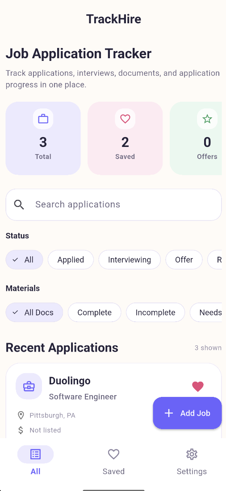
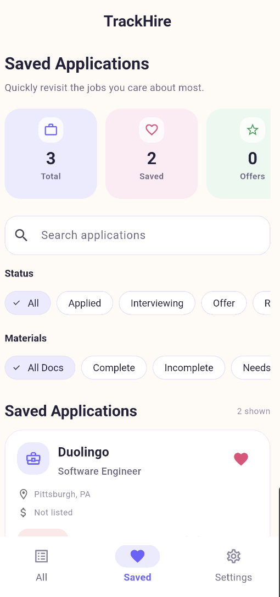
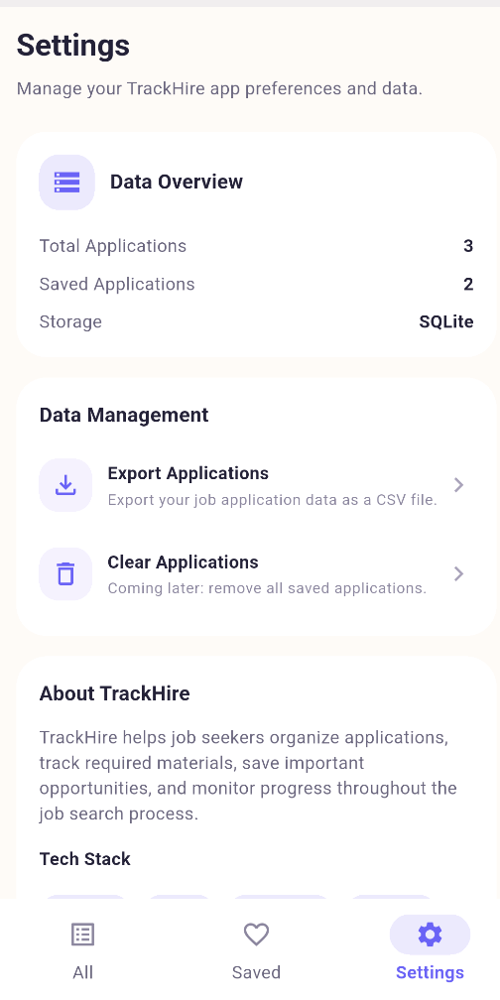

# TrackHire


TrackHire is a cross-platform Flutter job application tracker that helps job seekers organize applications, track required materials, save important opportunities, and manage job search progress in one clean workspace.

## Overview

Job searching can get messy fast. TrackHire gives users a structured way to manage job applications, including company details, role information, application status, salary range, location, notes, saved jobs, and required application materials.

The app started as a local Flutter application with SQLite persistence and has since been expanded into a backend-connected mobile platform. TrackHire now includes a Flutter frontend, Provider-based state management, a dedicated API service layer, a Node.js and Express REST API, persistent backend SQLite storage, CSV export support, and GitHub Actions CI.

## Screenshots

### Home Screen



### Saved Applications



### Settings



## Features

- Add, edit, delete, and view job applications
- Track application status: Applied, Interviewing, Offer, or Rejected
- Save important job applications to a dedicated Saved page
- Search applications by company, role, location, salary, or notes
- Filter applications by status and required materials
- Track materials such as resume, portfolio, cover letter, application questions, and other documents
- View dashboard stats for total applications, saved jobs, offers, interviews, and rejections
- Export job application data as a CSV file
- Share exported CSV files through the native mobile share sheet
- Connect the Flutter app to a Node.js and Express REST API
- Persist backend data using SQLite
- Handle API connection errors with a user-friendly error state
- Use a clean Material 3 UI with pastel dashboard cards and responsive mobile layouts
- Organize code with models, screens, widgets, providers, services, database, and backend layers
- Validate code quality through GitHub Actions CI for formatting, static analysis, testing, and Android debug APK builds

## Tech Stack

### Frontend

- Flutter
- Dart
- Provider
- Material 3
- http
- csv
- share_plus
- path_provider

### Local Data and App Services

- SQLite with sqflite
- Local model serialization
- CSV export service
- Native share-sheet integration

### Backend

- Node.js
- Express
- SQLite
- CORS
- REST API
- JSON request and response handling

### Development Tools

- Git
- GitHub
- GitHub Actions CI/CD
- Android Studio
- Flutter Analyze
- Flutter Test

## Architecture

```txt
Flutter UI
  ↓
Provider State Management
  ↓
ApiService
  ↓
Node.js / Express REST API
  ↓
SQLite Backend Database